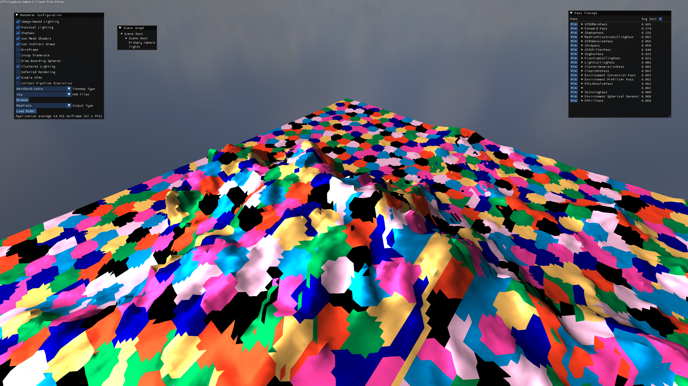
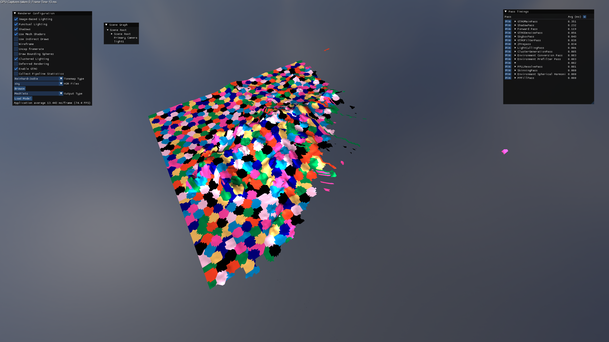

# BasicRenderer

A hobby DX12 renderer, written to experiment with real-time rendering for undergraduate ISPs and my own interest

Feature development is driven purely by what I'm interested in at the moment.

## Graphical features

- Image-based lighting
- Normal mapping & contact-refinement parallax heightmaps
- Support for arbitrary numbers of point, spot, and directional lights using clustered lighting
- Shadow mapping for all light types
- Skinned meshes
- Order-independent transparency using a per-pixel linked-list
- SSAO with XeGTAO
- Downsample/upsample bloom
- TAA/upscaling with DLSS/FSR
  
## Technical features

- GPU-driven rendering with compute culling & ExecuteIndirect
- Per-meshlet occlusion & frustrum culling
- Forward+ and Deferred rendering
- Clustered lighting with a paged linked-list
- A render graph for automatic resource transitions and queue synchronization, supporting symbolic subresoruce ranges
- Async-compute
- Compute-based skinning
- Meshlets & mesh shaders
- Flecs ECS for scene management
- A basic UI for feature toggles, importing new asset files, debug view selection, and scene graph introspection & modification

## Gallery

## Supported file formats
- Partial assimp loader implemented, https://github.com/assimp/assimp/blob/master/doc/Fileformats.md

## Third-party dependancies

- [nlohmann-json](https://github.com/nlohmann/json)
- [meshoptimizer](https://github.com/zeux/meshoptimizer)
- [spdlog](https://github.com/gabime/spdlog)
- [ImGui](https://github.com/ocornut/imgui)
- [assimp](https://github.com/assimp/assimp)
- [flecs](https://www.flecs.dev/flecs/)
- [XeGTAO](https://github.com/GameTechDev/XeGTAO)
- [FidelityFX SPD](https://gpuopen.com/fidelityfx-spd/)
  
## Notable sources for development ideas

[Filament](https://github.com/google/filament) for the material model, with additions from [MaterialX](https://github.com/AcademySoftwareFoundation/MaterialX)

[LearnOpenGL.com](https://learnopengl.com/)

[Erik Svjannson](https://www.youtube.com/watch?v=EtX7WnFhxtQ)'s talk on GPU-driven rendering and mesh shaders

[Medium article on occlusion culling](https://medium.com/@mil_kru/two-pass-occlusion-culling-4100edcad501)

