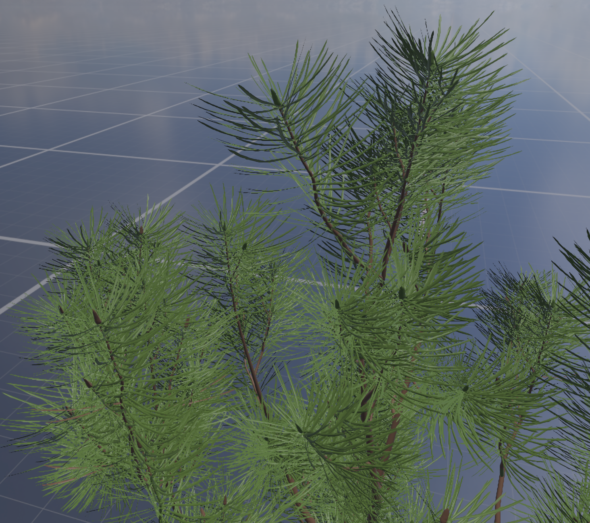
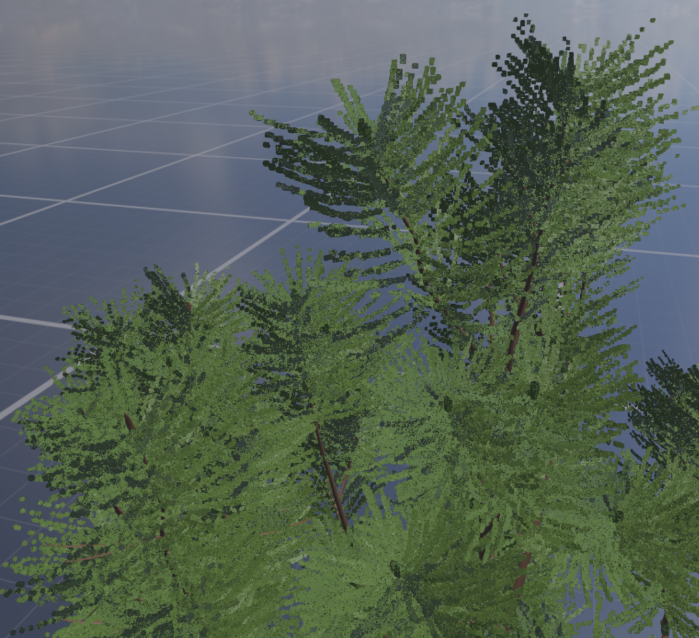
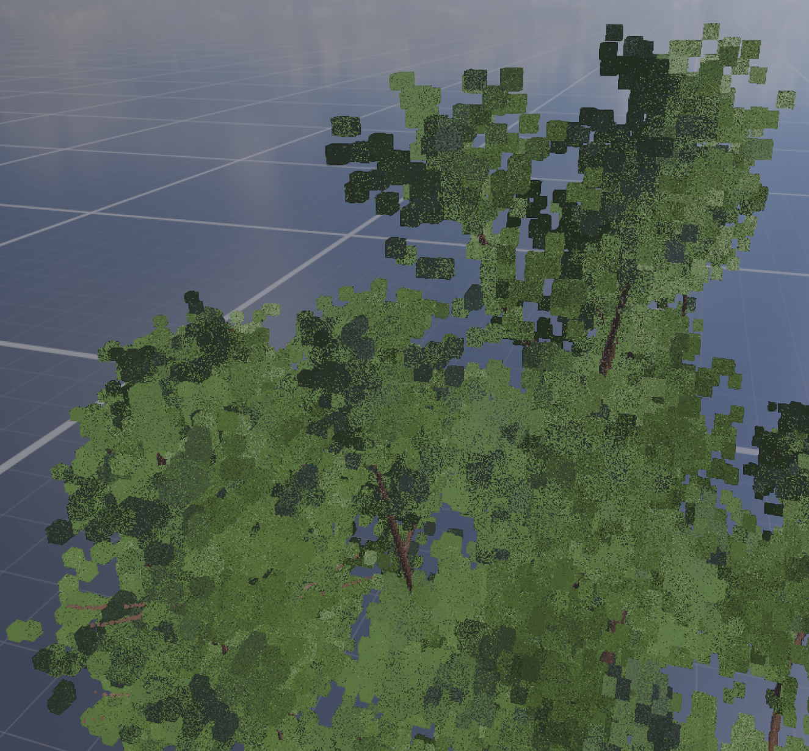

# BasicRenderer


An advanced DX12 research renderer, written to experiment with real-time rendering, built entirely around virtualized geometry

Feature development is driven purely by what I'm interested in at the moment.

## Graphical Features

- Nanite-style virtualized geometry using a novel work-graph approach, capable of real-time rendering of scenes with tens of billions of triangles
- Virtual shadow mapping (directional-only for now) with multiple experimental raster modes
- Voxel LOD fallback for virtualized geometry
- Image-based lighting
- Normal mapping & contact-refinement parallax heightmaps
- Support for arbitrary numbers of point, spot, and directional lights using clustered lighting
- Directional shadow mapping
- Skinned meshes
- Order-independent transparency using a per-pixel linked-list OR adaptive voxel-based OIT
- SSAO with XeGTAO
- Downsample/upsample bloom
- Screen-space reflections with FidelityFX SSSR
- TAA/upscaling with DLSS/FSR
  
## Technical Features
- A powerful render graph for automatic resource transitions and queue synchronization. Supports both retained-mode and immediate-mode GPU command execution, and caches itself automatically for better performance.
- Low-level RHI (Only DX12 backend implemented, for now, but built to support Vulkan)
- Shader-instrumentation debugging, using [GPU Reshape](https://github.com/GPUOpen-Tools/GPU-Reshape)'s backend
- GPU-driven rendering with compute culling & ExecuteIndirect
- Visibility buffer (UE5-style), Deferred, and forward+ rendering
- DirectStorage integration for low-latency, high-throughput data streaming
- GPU BC7 compressor for rapid asset optimization
- Clustered lighting with a paged linked-list
- Async-compute
- Compute-based skinning
- Meshlets & mesh shaders
- Flecs ECS for scene management
- A basic UI for feature toggles, importing new asset files, debug view selection, and scene graph introspection & modification

## Gallery





## Supported File Formats
- USD using OpenUSD, https://github.com/PixarAnimationStudios/OpenUSD
- Partial assimp loader implemented, https://github.com/assimp/assimp/blob/master/doc/Fileformats.md

## Notable Third-Party Dependancies

- [nlohmann-json](https://github.com/nlohmann/json)
- [meshoptimizer](https://github.com/zeux/meshoptimizer)
- [spdlog](https://github.com/gabime/spdlog)
- [ImGui](https://github.com/ocornut/imgui)
- [assimp](https://github.com/assimp/assimp)
- [flecs](https://www.flecs.dev/flecs/)
- [XeGTAO](https://github.com/GameTechDev/XeGTAO)
- [FidelityFX SPD](https://gpuopen.com/fidelityfx-spd/)
- [FidelityFX SSSR](https://gpuopen.com/fidelityfx-sssr/)
- [FSR](https://www.amd.com/en/products/graphics/technologies/fidelityfx/super-resolution.html)
- [DLSS](https://www.nvidia.com/en-us/geforce/technologies/dlss/)
- [OpenUSD](https://github.com/PixarAnimationStudios/OpenUSD)
- [GPU Reshape](https://github.com/GPUOpen-Tools/GPU-Reshape)
- [OneTBB](https://github.com/uxlfoundation/oneTBB)
- [SLang](https://github.com/shader-slang/slang)
- [Tracy](https://github.com/wolfpld/tracy)
- [Tree-Sitter](https://github.com/tree-sitter/tree-sitter)
- [DirectStorage](https://github.com/microsoft/DirectStorage)
  
## Notable Sources and References for Development

[Timberdoodle](https://github.com/Sunset-Flock/Timberdoodle) research engine

[Sparse Virtual Shadow Maps](https://ktstephano.github.io/rendering/stratusgfx/svsm), by J. Stephano

[Adaptive Voxel-based order-independant transparency](https://advances.realtimerendering.com/s2025/content/AVBOIT_SIG2025_MDROBOT-final.pdf), Siggraph 2025, Michal Drobot

[Nvidia tessellated clusters sample](https://github.com/nvpro-samples/vk_tessellated_clusters)

[Brian Karis's Reyes writeup](https://graphicrants.blogspot.com/2026/02/nanite-reyes.html)

[NVidia cluster LOD sample](https://github.com/nvpro-samples/vk_lod_clusters)

[Bevy's virtualized geometry](https://jms55.github.io/posts/2024-06-09-virtual-geometry-bevy-0-14/)

[Visibility Buffer Rendering with Material Graphs](http://filmicworlds.com/blog/visibility-buffer-rendering-with-material-graphs/), by John Hable

[Filament](https://github.com/google/filament) for the material model, with additions from [MaterialX](https://github.com/AcademySoftwareFoundation/MaterialX)

[LearnOpenGL.com](https://learnopengl.com/)

[Erik Svjannson](https://www.youtube.com/watch?v=EtX7WnFhxtQ)'s talk on GPU-driven rendering and mesh shaders

[Medium article on occlusion culling](https://medium.com/@mil_kru/two-pass-occlusion-culling-4100edcad501)

## Repository split and dependency model

The build is being structured so the main components can live as independent repositories:

- `BasicRHI` (low-level GPU abstraction)
- `OpenRenderGraph` (render graph framework, depends on `BasicRHI`)
- `BasicRenderer` (application, depends on both)

Current dependency strategy is **package-first with submodule fallback**:

- `BasicRenderer` tries `find_package(BasicRHI CONFIG)` and `find_package(OpenRenderGraph CONFIG)` first.
- If packages are not available and fallback is enabled, it uses in-tree `add_subdirectory(...)`.

Relevant options:

- `BASICRENDERER_USE_PACKAGE_DEPS` (default `ON`)
- `BASICRENDERER_ENABLE_SUBMODULE_FALLBACK` (default `ON`)

## Standalone consumption quick start

### 1) Build/install `BasicRHI`

```powershell
cmake -S BasicRHI -B out/build/rhi -G Ninja -DCMAKE_BUILD_TYPE=Debug
cmake --build out/build/rhi
cmake --install out/build/rhi --prefix out/install/rhi
```

### 2) Build/install `OpenRenderGraph` against installed `BasicRHI`

```powershell
cmake -S OpenRenderGraph -B out/build/org -G Ninja -DCMAKE_BUILD_TYPE=Debug -DCMAKE_PREFIX_PATH="out/install/rhi"
cmake --build out/build/org
cmake --install out/build/org --prefix out/install/org
```

### 3) Build `BasicRenderer` against installed packages

```powershell
cmake -S . -B out/build/renderer -G Ninja -DCMAKE_BUILD_TYPE=Debug -DBASICRENDERER_USE_PACKAGE_DEPS=ON -DBASICRENDERER_ENABLE_SUBMODULE_FALLBACK=OFF -DCMAKE_PREFIX_PATH="out/install/rhi;out/install/org"
cmake --build out/build/renderer
```

## USD selection notes

Top-level CMake now supports explicit USD package selection:

- `BASICRENDERER_USD_VARIANT=dbg|rel`

When unset, it auto-selects `rel` for multi-config generators and `dbg` only for single-config Debug builds.


